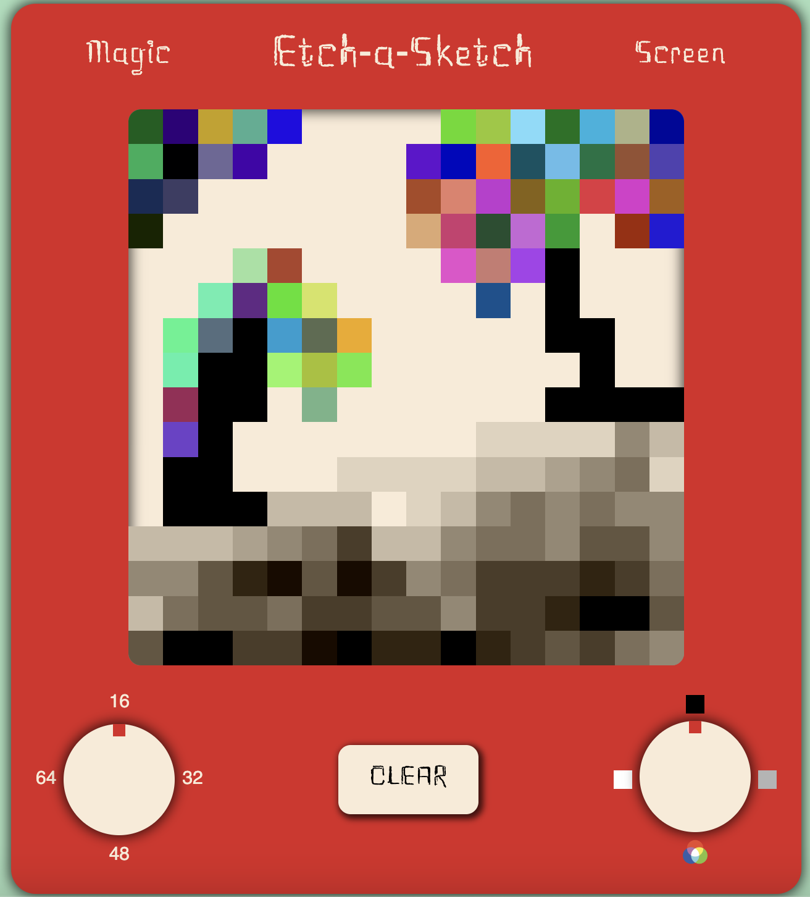

# Etch-a-Sketch
[Live Demo](https://nicholasrmccracken.github.io/etch-a-sketch): A web app emulating the functionality of the etch-a-sketch toy built with HTML, CSS, and JavaScript.

## Features:
- Toy-like design replicating the look of an original etch-a-sketch 
- "Pixel" size of the etch-a-sketch grid is adjustable via the left knob
- Four drawing options including a black pen, shader, randomized, and an eraser
- Button to clear the drawing board akin to shaking the etch-a-sketch

## Learning Outcomes: 
- Optimization and reusability techniques when updating CSS styles of DOM elements from JS
- Specialized functions for JS string manipulation
- Applications of JS objects
- Basic UX and UI creation
  
